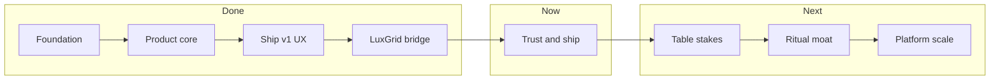

# Lights Out — Product Roadmap

**Last updated:** 2026-06-03 · **Current version:** 5.2.0  
**Canonical app:** `Desktop\Lights Out\SleepTimer.exe` · Source: `SleepTimer-Tonight.ps1`

---

## North star

**Open → countdown runs → PC shuts down safely.** One job, done well.

Lights Out is the bedtime ritual timer. LuxGrid is the optional RGB layer — never paywalled, never bundled into the core exe.

---

## Where we are today

| Area | Status |
|------|--------|
| Core timer (auto-start, tray ring, punch, confirm) | **Shipped** v3.8 |
| Steam-style lobby UI (LIB/SCH/SET, hero, session copy) | **Shipped** v5.2 |
| Lobby-first open (no auto-start unless opted in) | **Shipped** v5.2 |
| Safety (dry-run gates, audit log, Ctrl+Shift+S) | **Shipped** v3.6 |
| Rebrand (Lights Out, moon icon, logo) | **Shipped** v3.7 |
| LuxGrid event bridge (optional checkbox) | **Shipped** v3.9 |
| LuxGrid Studio inbox watching + Sleep Ritual profile | **Shipped** (local build) |
| GitHub Release | **Stale** — public tag is v3.6.0 |
| Winget | **PR submitted** — not merged |
| Production code signing | **Not done** — dev cert only |
| Dedicated repo | **Not done** — lives in ForgeCore_OS |
| CLI / graceful shutdown | **Not done** |

**Reality check:** The nightly app is ahead of distribution. The product works for you; legitimacy is a packaging and trust problem, not a feature problem.

---

## Roadmap phases

| Phase | Name | Goal | Status |
|-------|------|------|--------|
| **0** | Foundation | PS2EXE, dry-run safety, deploy script | Done |
| **1** | Product core | Settings schema, icon, release builds | Done v3.4 |
| **2** | Ship v1 UX | Tray, run at login, installer, emergency cancel | Done v3.6 |
| **3** | Brand + delight | Lights Out rebrand, live tray ring, punch animation | Done v3.8 |
| **4** | LuxGrid bridge | Optional RGB events, Studio consumer, Sleep Ritual | Done v3.9 |
| **5** | **Trust & distribution** | Signing, winget, repo, v3.9 release | **Active** — [v3.9.0 live](https://github.com/Z3r0DayZion-install/ForgeCore_OS/releases/tag/v3.9.0) · [LightsOut repo](https://github.com/Z3r0DayZion-install/LightsOut) · [WinGet PR](https://github.com/microsoft/winget-pkgs/pull/382877) |
| **6** | Table stakes | CLI, graceful shutdown, clock schedule | Planned |
| **7** | Ritual moat | Named profiles, blocker warning, LuxGrid pack | Planned |
| **8** | Platform (optional) | .NET WinUI rewrite, Store / MSIX | Later |

---

## Phase 5 — Trust & distribution (active)

**Goal:** A stranger can find, install, and trust Lights Out without knowing you.

| # | Task | Why | Exit criteria |
|---|------|-----|---------------|
| 5.1 | **Production Authenticode signing** | SmartScreen, winget policy | Signed exe + installer; no "Unknown publisher" |
| 5.2 | **Publish GitHub Release v3.9.0** | Public downloads match VERSION | Tag, portable exe, Inno installer, CHANGELOG |
| 5.3 | **Winget merge + hash update** | `winget install KickA.LightsOut` works | PR merged; manifest matches signed hash |
| 5.4 | **Dedicated GitHub repo** | Issues, stars, README screenshots | `KickA/LightsOut` or equivalent; not buried in monorepo |
| 5.5 | **Landing README** | First impression | Hero screenshot, feature list, install one-liners |
| 5.6 | **7-night dogfood log** | Confidence before 1.0 label | `DOGFOOD.md` entries; zero accidental shutdowns in tests |

**Target:** Phase 5 complete → call it **Lights Out 1.0**.

---

## Phase 6 — Table stakes (competitor parity)

**Goal:** Match [Shutdown Timer Classic](https://github.com/lukaslangrock/ShutdownTimerClassic) on power-user basics without bloating the bedtime UX.

| # | Task | Priority |
|---|------|----------|
| 6.1 | **CLI args** — `/minutes`, `/action`, `/start`, `/minimized` | ✅ v4.1 |
| 6.2 | **Graceful shutdown toggle** — no `-Force` by default | ✅ v4.1 |
| 6.3 | **Clock-time schedule** — "shut down at 11:30 PM" | ✅ v4.2 |
| 6.4 | **Pause/resume polish** — clearer UI state, tray label | ✅ v4.3 |
| 6.5 | **Hibernate / Lock** actions | ✅ v4.3 |

---

## Phase 7 — Ritual moat (why Lights Out)

**Goal:** Own "bedtime lights out" — not another generic scheduler.

| # | Task | Product |
|---|------|---------|
| 7.1 | **Ritual presets** — "Weeknight 24m", "Movie 45m sleep" one-tap | ✅ v5.0 |
| 7.2 | **`powercfg /requests` warning** — alert if something blocks sleep before arming | ✅ v4.4 |
| 7.3 | **Sleep Ritual LuxGrid pack** — exportable profile, punch-synced fade | ✅ v5.0 |
| 7.4 | **Per-key RGB in Live mode** — Vulcan key map, not fill-only | LuxGrid Studio |
| 7.5 | **OpenRGB path in Live engine** — not only direct HID | LuxGrid Studio |

LuxGrid stays optional. Core timer must work with zero RGB installed.

---

## Phase 8 — Platform (optional, long-term)

| Milestone | Trigger |
|-----------|---------|
| .NET 8 WinUI 3 rewrite | PS2EXE limits signing, Store, or perf |
| Microsoft Store / MSIX | After production cert + 1.0 stable |
| Settings migration | One-time import from `%LOCALAPPDATA%\CoolTimer\settings.json` |

Do not start Phase 8 until Phase 5–6 are done and dogfooded.

---

## LuxGrid track (parallel)

| Milestone | Status | Next |
|-----------|--------|------|
| Event inbox + SDK schema | Done | — |
| Lights Out → inbox events | Done v3.9 | — |
| Studio EventBridge (real watch) | Done | Ship Studio installer alongside 1.0 |
| Sleep Ritual profile (QWERTY, warn, punch) | Done | Export as downloadable pack |
| Snoozurp bridge CLI | Done | Document as dev/test tool only |
| Hardware proof (Roccat HID) | Verified locally | OpenRGB live path |

See [`LUXGRID-LIGHTSOUT.md`](LUXGRID-LIGHTSOUT.md) for the full stack.

---

## Release train

| Version | Theme | Ship when |
|---------|-------|-----------|
| **3.9.0** | LuxGrid bridge | Built locally — **publish release** |
| **4.0.0** | Lights Out 1.0 — signed, winget, repo | Phase 5 complete |
| **4.1.0** | CLI + graceful shutdown | Phase 6.1–6.2 |
| **4.2.0** | Clock schedule | Phase 6.3 |
| **5.0.0** | Ritual moat + LuxGrid pack | **Shipped** — one-tap rituals, Sleep Ritual pack |

Version bumps follow [`CHANGELOG.md`](CHANGELOG.md). GitHub tag must match `VERSION` file before calling a release done.

---

## Next 10 tasks (ordered)

1. ~~Production code signing cert~~ — dev cert only; production cert still needed
2. ~~`Publish-GitHubRelease.ps1` for **v3.9.0**~~ ✅ [released](https://github.com/Z3r0DayZion-install/ForgeCore_OS/releases/tag/v3.9.0)
3. **Winget merge** — [PR #382877](https://github.com/microsoft/winget-pkgs/pull/382877) open
4. ~~Dedicated GitHub repo~~ ✅ [Z3r0DayZion-install/LightsOut](https://github.com/Z3r0DayZion-install/LightsOut)
5. ~~README screenshots~~ — banner + logo live; app screenshot TBD
6. Graceful shutdown setting + `Do-PowerAction` without `-Force`
7. CLI args in `SleepTimer-Tonight.ps1` param block
8. Dogfood nights 1–7 in `DOGFOOD.md`
9. ~~LuxGrid Sleep Ritual profile export~~ ✅ `Export-LuxGrid-SleepRitualPack.ps1`
10. ~~Blocked-shutdown hint (`powercfg /requests`) before Start~~ ✅ v4.4

---

## Explicitly not on the roadmap

- Accounts, cloud sync, mobile apps
- Subscriptions or paywalling shutdown
- Merging legacy `SleepTimer.ps1` (1400 lines)
- RGB logic inside the timer exe (events only)
- Gamification, achievements, idle/CPU triggers
- Force-push, auto-update telemetry without opt-in

---

## Stack

| Layer | Now | 1.0 target | Long-term |
|-------|-----|------------|-----------|
| Timer app | PowerShell + PS2EXE | Same + signed Inno | .NET 8 WinUI 3 |
| Settings | `%LOCALAPPDATA%\CoolTimer\settings.json` | Unchanged | Migrate once |
| RGB | LuxGrid Studio + inbox JSON | Optional sidecar | LuxGrid 1.0 installer |
| CI | `Test-SleepTimer.ps1`, `CI-Local.ps1` | GitHub Actions aligned to repo | Same gates |

---

## Success metrics

| Metric | 1.0 target |
|--------|------------|
| Nightly use | You run it 7+ nights without workaround |
| Zero test shutdowns | Dry-run gates hold in CI/automation |
| Install path | winget OR signed installer in under 2 minutes |
| Discovery | README + screenshot understandable without context |
| LuxGrid opt-in | RGB works when checked; invisible when off |

---

## Monetization

**Lights Out:** Free, MIT — forever.

**LuxGrid (optional):** Sleep Ritual profile pack or Studio Pro — only after hardware path is boringly reliable. Never charge for shutdown.

---

## Related docs

| Doc | Purpose |
|-----|---------|
| [`MARKET.md`](MARKET.md) | Competitive research |
| [`PRODUCT.md`](PRODUCT.md) | User-facing product page (needs v3.9 refresh) |
| [`CHANGELOG.md`](CHANGELOG.md) | Version history |
| [`DOGFOOD.md`](DOGFOOD.md) | Nightly validation log |
| [`LUXGRID-LIGHTSOUT.md`](LUXGRID-LIGHTSOUT.md) | RGB stack setup |
| [`AGENTS.md`](AGENTS.md) | Agent safety rules |
