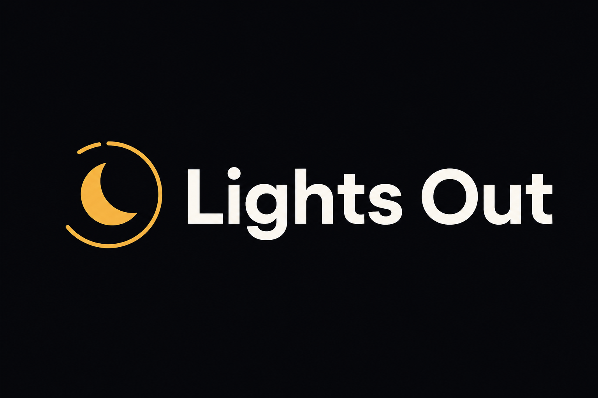

<p align="center">
  
</p>

<p align="center">
  <strong>The bedtime shutdown timer for Windows.</strong><br/>
  Open it. See when your PC dies. Cancel if you're still up. Lights out.
</p>

<p align="center">
  <a href="https://github.com/Z3r0DayZion-install/ForgeCore_OS/releases"></a>
  
  
  
  
</p>

<p align="center">
  <a href="#download">Download</a> ·
  <a href="#features">Features</a> ·
  <a href="#screenshots">Screenshots</a> ·
  <a href="#luxgrid-rgb-optional">LuxGrid</a> ·
  <a href="#safety">Safety</a> ·
  <a href="#build">Build</a>
</p>

<p align="center">
  
</p>

---

## Why Lights Out?

Most shutdown timers feel like utilities from 2010 — tiny windows, static tray icons, no sense of *bedtime*.

**Lights Out** is built for one ritual: you open it at night, the countdown **auto-starts**, you see **exactly when the PC will shut down**, and you get **warnings + an emergency cancel** if you're still awake.

No accounts. No cloud. No ads. **~120 KB portable exe.**

---

## Download

### Portable (recommended)

1. Download **[SleepTimer.exe](https://github.com/Z3r0DayZion-install/ForgeCore_OS/releases/latest/download/SleepTimer.exe)** from [Releases](https://github.com/Z3r0DayZion-install/ForgeCore_OS/releases)
2. Double-click — no admin required
3. Timer auto-starts (or use presets first)

### Installer

Download **`SleepTimer-Setup-3.9.0.exe`** from Releases — installs to `%LOCALAPPDATA%\Programs\Lights Out\` with Start Menu shortcut.

### WinGet

```powershell
winget install KickA.LightsOut
```

*(Also available as `KickA.SleepTimer` during manifest transition.)*

### Build yourself

```powershell
git clone https://github.com/Z3r0DayZion-install/ForgeCore_OS.git
cd LightsOut
.\scripts\Deploy-SleepTimer-Desktop.ps1
# → Desktop\Lights Out\Lights Out.bat
```

---

## Features

| | |
|---|---|
| **One-tap rituals** | Weeknight · 28:20 · Movie (sleep) · Bedtime 11:30 PM — [guide](docs/RITUALS.md) |
| **Auto-start countdown** | Open → timer runs. Presets: 24m, 28:20, 30m, 45m |
| **Live tray ring** | Ring drains in the tray — color matches Shutdown / Sleep / Restart |
| **End time clock** | *"Ends at 2:47 PM · shutdown"* before and during countdown |
| **5-minute warning** | Sound + tray balloon with end time |
| **30-second alert** | Flashing tray icon + *Ctrl+Shift+S to cancel* hint |
| **Punch + LIGHTS OUT** | Animation at zero, then 5-second confirm dialog |
| **Emergency cancel** | **Ctrl+Shift+S** globally — even from tray |
| **Snooze** | +5 min or +10 min without restarting |
| **Run at login** | Same ritual every night |
| **Local audit log** | `%LOCALAPPDATA%\CoolTimer\actions.log` — no phone-home |

---

## Screenshots

<p align="center">
  
</p>

| Main window | Tray |
|-------------|------|
| Progress ring, end-time clock, action pills, presets | Live ring drains as time runs out |

> **Tip:** After install, pin `Lights Out.bat` or `SleepTimer.exe` to taskbar for one-click bedtime.

---

## How it works

```
  Open app          Countdown runs              Time's up
      │                   │                         │
      ▼                   ▼                         ▼
 Auto-start ──► Tray ring + warnings ──► Punch ──► Confirm ──► Shut down
                     │                      │
              Ctrl+Shift+S cancel      Snooze +10m
```

1. **Set duration** — or use your usual preset (default ~28 min)
2. **Minimize to tray** — ring shows remaining time
3. **5 min / 30 sec warnings** — hard to forget it's armed
4. **At zero** — punch animation, then *"Still awake?"* with 5-second countdown
5. **Shut down, sleep, or restart** — your choice every night

---

## LuxGrid RGB (optional)

Pair with **[LuxGrid Studio](https://github.com/Z3r0DayZion-install/LuxGrid)** for a keyboard countdown ritual:

1. In Lights Out → check **LuxGrid RGB**
2. In LuxGrid Studio → **Sleep Ritual** profile → **Start Watching**
3. QWERTY keys drain with the timer; number row flashes at 30s; punch syncs on `lights.out`

Events: `%LOCALAPPDATA%\LuxGrid\events\inbox\` · [Full setup guide](LUXGRID-LIGHTSOUT.md)

---

## Safety

| Guard | Detail |
|-------|--------|
| **60s minimum** | Production builds can't arm a 5-second "prank shutdown" |
| **Ctrl+Shift+S** | Emergency cancel anytime — logged to audit file |
| **Final confirm** | 5-second dialog after animation — snooze or proceed |
| **Dry-run mode** | `-DryRun` / `SLEEPTIMER_DRY_RUN=1` for dev & CI |
| **No telemetry** | Everything stays on your machine |

---

## vs. other timers

| | **Lights Out** | Shutdown Timer Classic | Wise Auto Shutdown |
|---|:---:|:---:|:---:|
| Bedtime-first UX | ✅ | — | — |
| Live tray progress ring | ✅ | — | — |
| End time clock | ✅ | partial | — |
| Punch / ritual animation | ✅ | — | — |
| Emergency global hotkey | ✅ | — | — |
| Local audit log | ✅ | — | — |
| WinGet / Store | pending | ✅ | — |
| CLI automation | roadmap | ✅ | — |

---

## Requirements

- **Windows 10 or 11** (64-bit)
- No .NET install — single portable exe (PowerShell compiled)
- **~120 KB** download

---

## Command line

Automate your nightly ritual from Task Scheduler, a shortcut, or terminal:

```powershell
# 28-minute shutdown, auto-start, minimized to tray
SleepTimer.exe -Minutes 28 -Action Shutdown -Minimized

# Slash style (compatible with classic shutdown timers)
SleepTimer.exe /minutes 28 /action shutdown /start /min

# Configure without starting
SleepTimer.exe -NoAutoStart

# Shut down at 11:30 PM tonight
SleepTimer.exe -At "11:30 PM" -Action Shutdown -Start

# Help dialog
SleepTimer.exe -Help
```

| Flag | Description |
|------|-------------|
| `-Minutes` / `/minutes` | Countdown duration |
| `-Action` / `/action` | `shutdown`, `sleep`, or `restart` |
| `-Start` / `/start` | Auto-start countdown (default) |
| `-NoAutoStart` | Open app without starting |
| `-Minimized` / `/min` | Start in tray |
| `-DryRun` | Safe mode - no power action |
| **Graceful exit** (Settings) | Lets apps save before shutdown (default **on**) |
| `-At` / `/at` | Clock time — e.g. `-At 23:30` or `-At "11:30 PM"` |
| `-Action` | `shutdown`, `sleep`, `restart`, `hibernate`, `lock` |

| **Blocker warn** (Settings) | Check `powercfg /requests` before start (default **on**) |

Environment variables: `SLEEPTIMER_MINUTES`, `SLEEPTIMER_ACTION`, `SLEEPTIMER_START`, `SLEEPTIMER_DRY_RUN`, `SLEEPTIMER_AT`

---

## Build from source

```powershell
# Safe validate + build (never launches timer / never shuts down PC)
.\scripts\CI-Local.ps1

# Deploy to Desktop\Lights Out
.\scripts\Deploy-SleepTimer-Desktop.ps1

# Dry-run UI test only
.\scripts\Test-Daytime.ps1 -Launch -UseExe -Seconds 60
```

Source: [`SleepTimer-Tonight.ps1`](SleepTimer-Tonight.ps1) · Version: [`VERSION`](VERSION) · Changelog: [`CHANGELOG.md`](CHANGELOG.md)

---

## Roadmap

**Now:** production signing, v3.9 GitHub release, WinGet, dedicated repo  
**Now:** Lights Out **5.0** — rituals + full 4.x table stakes  
**Next:** production signing, WinGet merge, 7-night dogfood  
**Later:** LuxGrid Studio per-key RGB (7.4), OpenRGB live path (7.5)

Full plan → [`PRODUCT_ROADMAP.md`](PRODUCT_ROADMAP.md)

---

## Project layout

```

├── SleepTimer-Tonight.ps1    # App source
├── scripts/                  # Build, deploy, release
├── docs/          # README assets
├── packaging/winget/         # WinGet manifests
├── installer/                # Inno Setup
├── luxgrid/                  # Optional RGB platform
├── PRODUCT.md                # Product brief
└── CHANGELOG.md
```

---

## License

**MIT** — free for personal and commercial use. See [LICENSE](LICENSE).

---

<p align="center">
  <sub>Made for people who want the PC off at night — not another task scheduler.</sub>
</p>

