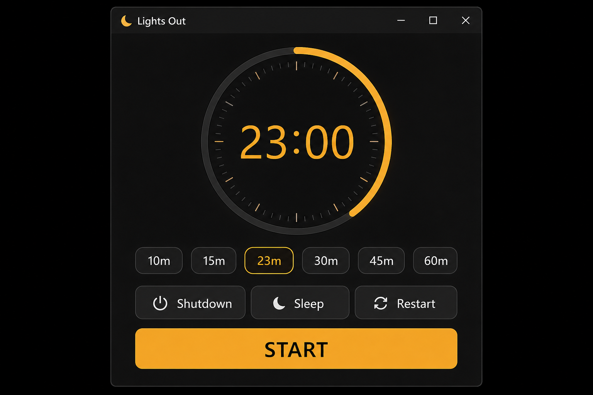
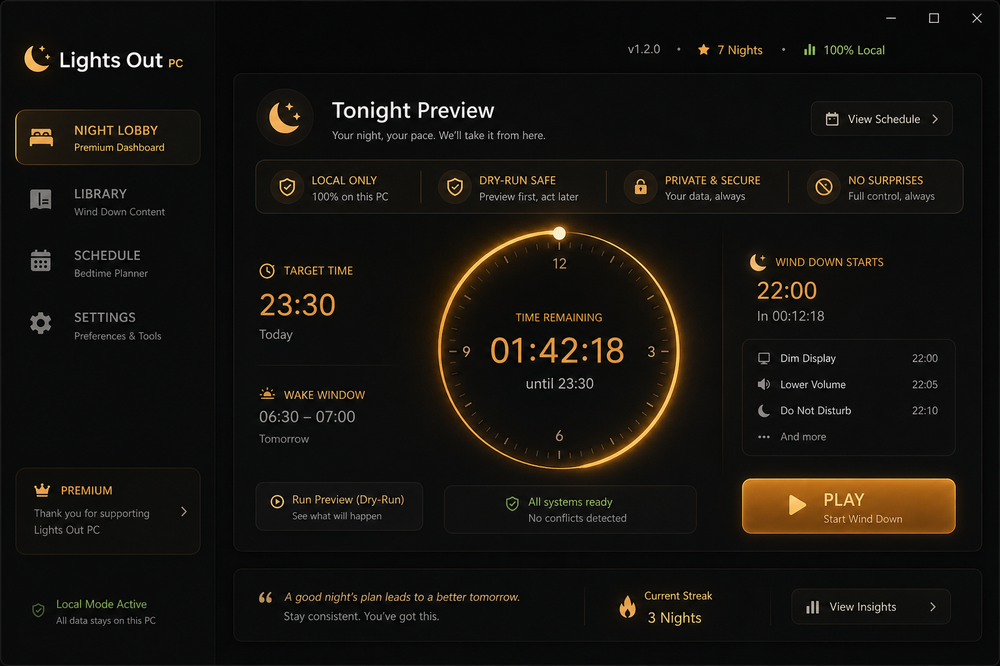
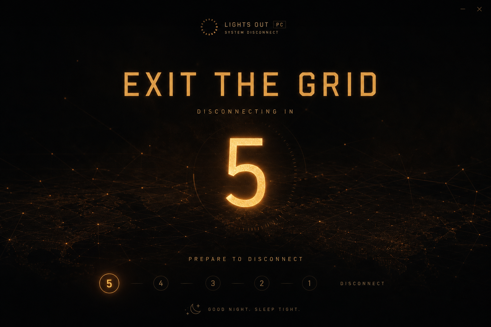
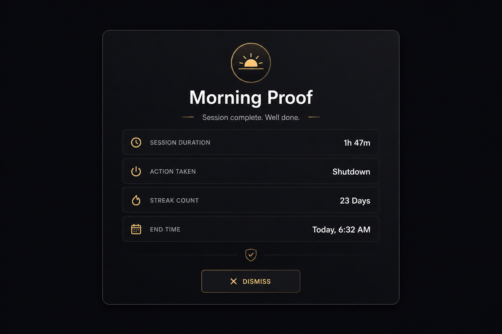

<p align="center">
  
</p>

<h1 align="center">Lights Out PC</h1>

<p align="center">
  <strong>Bedtime Mode for Windows</strong><br/>
  A local-only Windows sleep timer and PC shutdown timer for nightly use — with final confirm, emergency cancel, and dry-run preview.
</p>

<p align="center">
  <a href="https://github.com/Z3r0DayZion-install/ForgeCore_OS/releases"></a>
  
  
  
  
</p>

<p align="center">
  <a href="#fast-start">Fast start</a> ·
  <a href="#two-modes">Two modes</a> ·
  <a href="#screenshots">Screenshots</a> ·
  <a href="#features">Features</a> ·
  <a href="#safety">Safety</a> ·
  <a href="#integration">Integration</a> ·
  <a href="#build--ci">Build & CI</a> ·
  <a href="#docs">Docs</a>
</p>

---

## What it is

**Lights Out PC** is a **local-only bedtime timer for Windows**. Set a countdown, choose **Shutdown / Sleep / Restart / Hibernate / Lock**, and start a safe nightly run.

Open → choose tonight's run → **START** or **PLAY** → countdown → PC does the power action safely.

No accounts. No cloud sync. No ads. No telemetry. Built for real bedtime use — not a demo toy.

| | |
|---|---|
| **Product** | Lights Out PC |
| **Full title** | Lights Out PC — Bedtime Mode for Windows |
| **Canonical source** | [`SleepTimer-Tonight.ps1`](SleepTimer-Tonight.ps1) |
| **Desktop app** | `Desktop\Lights Out\SleepTimer.exe` |
| **Modules** | `modules\LightsOut.*.psm1` |

```text
Standalone first.  Modular always.  Hard dependency never.
```

---

## Fast start

### Open the normal timer (Classic — live)

Double-click **`Desktop\Lights Out\Lights Out.bat`** or:

```powershell
& "$env:USERPROFILE\Desktop\Lights Out\SleepTimer.exe" -ClassicUi -NoAutoStart
```

Set minutes → pick action → **START**.

### Start a 23-minute shutdown

```powershell
& "$env:USERPROFILE\Desktop\Lights Out\SleepTimer.exe" -ClassicUi -Minutes 23 -Action Shutdown -Start
```

### Safe preview (dry-run — no real power action)

```powershell
Start-Process "$env:USERPROFILE\Desktop\Lights Out\SleepTimer.exe" -ArgumentList '-ClassicUi','-DryRun','-NoAutoStart'
```

### Premium Night Lobby preview (Steam — dry-run only)

Double-click **`Desktop\Lights Out Premium Preview.bat`**, or:

```powershell
Start-Process "$env:USERPROFILE\Desktop\Lights Out\SleepTimer.exe" -ArgumentList '-SteamUi','-DryRun','-NoAutoStart'
```

More walkthrough → [`docs/lights-out/GETTING-STARTED.md`](docs/lights-out/GETTING-STARTED.md)

---

## Two modes

| Mode | Purpose | Launcher |
|------|---------|----------|
| **Classic UI** | Real bedtime timer — simple, usable first | Normal `Lights Out.lnk` / `Lights Out.bat` |
| **Steam / Night Lobby** | Premium preview, rituals, Last Light, Morning Proof | `Lights Out Premium Preview.bat` (`-SteamUi -DryRun`) |

```text
Classic UI = duration timer first  (default live path)
Steam UI   = premium Night Lobby   (optional DryRun preview)
```

**Do not judge premium UI from the normal shortcut.** Classic is intentionally the live launcher. Steam/Night Lobby polish is checked through Premium Preview only.

Details → [`docs/lights-out/SIMPLE-TIMER.md`](docs/lights-out/SIMPLE-TIMER.md) · [`docs/lights-out/UI-REFERENCE.md`](docs/lights-out/UI-REFERENCE.md)

---

## Screenshots

Visual north-star references in [`docs/assets/lights-out/`](docs/assets/lights-out/):

| Caption | Reference | Description |
|---------|-----------|-------------|
| **Classic UI — simple timer** |  | Timer amount, quick chips, analog ring, action pills, START |
| **Night Lobby — premium mode** |  | Tonight Preview, trust badges, Tonight Cards, PLAY |
| **Last Light — shutdown finale** |  | Exit The Grid sequence before final confirm |
| **Morning Proof — next launch** |  | Session result screen after a completed run |

Mockups guide polish only — not pixel-perfect specs.

---

## Features

- **Windows sleep timer** — countdown with analog-style ring (digital time + progress arc)
- **PC shutdown timer** — Shutdown, Sleep, Restart, Hibernate, Lock
- **Shutdown timer with final confirm** — 5-second dialog before power action; snooze available
- **Emergency cancel** — global `Ctrl+Shift+S` hotkey anytime
- **Dry-run preview** — `-DryRun` / Demo mode for safe testing
- **Classic UI** — timer amount first, quick chips (10m–60m), minimal layout
- **Night Lobby** — premium Steam-style UI with Tonight Cards and trust badges
- **Last Light** — cinematic shutdown finale sequences (DryRun safe)
- **Morning Proof** — next-launch session summary
- **Sleep Clearance** — pre-play checklist in Night Lobby
- **Clock & calendar scheduling** — optional `.ics` import
- **Tray icon** — live progress while running
- **Local audit log** — `%LOCALAPPDATA%\CoolTimer\actions.log`

---

## Safety

Lights Out controls real power on your PC. Safety is non-negotiable.

| Guard | Detail |
|-------|--------|
| **60s minimum** | Production builds cannot arm a prank-length shutdown |
| **Final confirm** | 5-second dialog after countdown — snooze or proceed |
| **Emergency cancel** | `Ctrl+Shift+S` anytime |
| **Dry-run** | `-DryRun` / `SLEEPTIMER_DRY_RUN=1` — no power action |
| **Demo mode** | `-Demo` implies DryRun; skips real settings/log writes |
| **CI gate** | `SLEEPTIMER_CI=1` blocks power in automated runs |
| **Power gate** | `Test-NoPowerAction` → `Do-PowerAction` (sole execution path) |

Full model → [`docs/lights-out/SAFETY-MODEL.md`](docs/lights-out/SAFETY-MODEL.md)

Windows fallback if the app fails:

```powershell
shutdown /s /t 1380 /f /c "Force shutdown in 23 minutes. Cancel with shutdown /a"
shutdown /a   # cancel
```

---

## Command line

| Use | Command |
|-----|---------|
| Normal open | `SleepTimer.exe -ClassicUi -NoAutoStart` |
| Live run | `SleepTimer.exe -ClassicUi -Minutes 23 -Action Shutdown -Start` |
| Safe test | `SleepTimer.exe -ClassicUi -DryRun -NoAutoStart` |
| Night Lobby preview | `SleepTimer.exe -SteamUi -DryRun -NoAutoStart` |
| Demo | `SleepTimer.exe -Demo -NoAutoStart` |
| Help | `SleepTimer.exe -Help` |

Full reference → [`docs/lights-out/CLI.md`](docs/lights-out/CLI.md)

Environment variables: `SLEEPTIMER_MINUTES`, `SLEEPTIMER_ACTION`, `SLEEPTIMER_DRY_RUN`, `SLEEPTIMER_DEMO`, `SLEEPTIMER_CI`

---

## Integration

Lights Out works **fully standalone**. Optional bridges connect to the broader Neural ecosystem — off by default:

| Bridge | Required? | Detail |
|--------|-----------|--------|
| **LuxGrid RGB** | No | Local JSON events → RGB keyboard lighting |
| **NeuralOS** | No | Future dashboard integration |
| **NeuralShell** | No | Future automation hooks |
| **Snoozurp** | No | Future sleep-layer adapter |

```text
Lights Out Core  →  timer, safe power, confirm, audit
Optional bridges →  LuxGrid, NeuralOS, NeuralShell, Snoozurp, future launchers
```

Contract → [`docs/lights-out/INTEGRATION-CONTRACT.md`](docs/lights-out/INTEGRATION-CONTRACT.md) · LuxGrid setup → [`LUXGRID-LIGHTSOUT.md`](LUXGRID-LIGHTSOUT.md)

---

## Build & CI

```powershell
cd windsurf-project

# Safe validate (never launches timer / never shuts down PC)
.\scripts\Test-AgentSafety.ps1
.\scripts\Test-SleepTimer.ps1
.\scripts\Test-Docs.ps1          # doc link + safety lint
.\scripts\CI-Local.ps1

# Deploy to Desktop\Lights Out (no auto-launch)
.\scripts\Deploy-SleepTimer-Desktop.ps1
```

CI workflows: [`.github/workflows/lights-out-ci.yml`](.github/workflows/lights-out-ci.yml) (docs + safety gates) · [`.github/workflows/sleep-timer-ci.yml`](.github/workflows/sleep-timer-ci.yml) (release build)

Release checklist → [`docs/lights-out/RELEASE-CHECKLIST.md`](docs/lights-out/RELEASE-CHECKLIST.md) · CI guide → [`docs/lights-out/CI.md`](docs/lights-out/CI.md)

---

## Troubleshooting

See [`docs/lights-out/TROUBLESHOOTING.md`](docs/lights-out/TROUBLESHOOTING.md).

Quick checks:

- Use **`Lights Out.bat`** for live Classic UI (not Demo, not DryRun).
- Premium UI? Use **`Lights Out Premium Preview.bat`** — not the normal shortcut.
- Missing modules → run from `Desktop\Lights Out\` (needs `modules\LightsOut.*.psm1`).
- Safe testing always uses **`-DryRun`**.

---

## Roadmap

**Shipped (5.2):** Classic simple timer, Night Lobby, Last Light, Morning Proof, Sleep Clearance, analog ring  
**Next:** GitHub release aligned with `VERSION`, WinGet refresh, 7-night dogfood  
**Optional:** LuxGrid RGB pairing — not required

Full plan → [`PRODUCT_ROADMAP.md`](PRODUCT_ROADMAP.md)

---

## What Lights Out is not

- **Not a cloud app** — no accounts, no sync, no telemetry
- **Not a medical sleep product** — no health claims
- **Not LuxGrid-dependent** — RGB bridge is optional
- **Not NeuralOS-dependent** — ecosystem bridges are optional
- **Not Electron / WPF** — canonical app is PowerShell WinForms (`SleepTimer-Tonight.ps1`)
- **Not a redesign experiment** — `CoolTimer.ps1` and `SleepTimer-Electron/` are not canonical

---

## Docs

| Doc | Purpose |
|-----|---------|
| [`docs/lights-out/GETTING-STARTED.md`](docs/lights-out/GETTING-STARTED.md) | First-night walkthrough |
| [`docs/lights-out/SAFETY-MODEL.md`](docs/lights-out/SAFETY-MODEL.md) | Power gates, DryRun, agent rules |
| [`docs/lights-out/CLI.md`](docs/lights-out/CLI.md) | Flags and examples |
| [`docs/lights-out/UI-REFERENCE.md`](docs/lights-out/UI-REFERENCE.md) | Visual north-star mockups |
| [`docs/lights-out/INTEGRATION-CONTRACT.md`](docs/lights-out/INTEGRATION-CONTRACT.md) | Ecosystem event contract |
| [`docs/lights-out/RELEASE-CHECKLIST.md`](docs/lights-out/RELEASE-CHECKLIST.md) | RC release steps |
| [`docs/lights-out/CI.md`](docs/lights-out/CI.md) | CI workflows and triage |
| [`docs/agent-handbook/AGENT-QUICKSTART.md`](docs/agent-handbook/AGENT-QUICKSTART.md) | Agent safety handoff |

---

## License

**MIT** — free for personal and commercial use. See [LICENSE](LICENSE).
