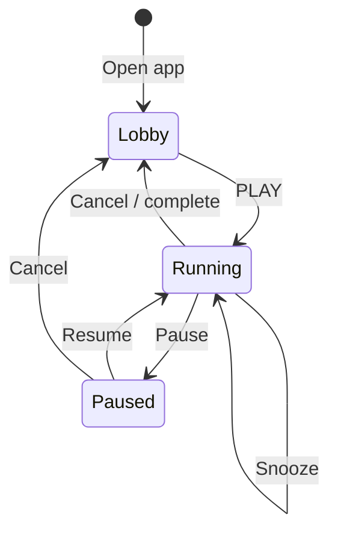

# Glossary

Terms used in Lights Out docs and code. These definitions apply to Lights Out only unless stated otherwise.

## Product terms

| Term | Meaning |
|---|---|
| Lights Out | Product/display name. Windows bedtime shutdown/sleep timer. |
| SleepTimer.exe | Canonical executable filename, kept for compatibility. |
| SleepTimer-Tonight.ps1 | Canonical source file. |
| CoolTimer | Legacy settings folder under `%LOCALAPPDATA%`. |
| Agent handbook | `docs/agent-handbook/`, the code-agent operating manual. |
| Canonical | The source/build path agents should treat as real product truth. |
| Experiment | Old/alternate stack that should not be edited unless named by user. |

## UI terms

| Term | Meaning |
|---|---|
| Lobby | Pre-PLAY state. No active countdown. |
| Session | Running or paused countdown after PLAY. |
| PLAY | Primary button to begin a session. |
| LIB | Library page: rituals and presets. |
| SCH | Schedule page: duration, clock, calendar. |
| SET | Settings page: action pills and options. |
| Steam UI | Default dark library-style interface. |
| Classic UI | Older card-style interface. |
| Hero panel | Main Steam header area for session title/badge. |
| Ring | Circular target/countdown display. |
| Cinema mode | Fullscreen countdown overlay. |
| Big Picture | Internal name for Cinema form/functions. |

## Timer terms

| Term | Meaning |
|---|---|
| Ritual | One-tap preset, such as Weeknight, Movie, Bedtime. |
| Profile | Saved named timer in `SavedTimers`. |
| Duration mode | Countdown from a chosen duration. |
| Clock mode | Countdown until a clock time tonight/next occurrence. |
| Calendar mode | Countdown from selected ICS/calendar event. |
| Snooze | Extend an active countdown. |
| Pause | Freeze countdown while preserving remaining time. |
| Cancel | Stop session and return to Lobby. |
| Emergency cancel | Fast cancel path through tray or `Ctrl+Shift+S`. |

## Safety terms

| Term | Meaning |
|---|---|
| Dry run | `-DryRun` or env gate that logs/tests without real power action. |
| CI safe mode | `SLEEPTIMER_CI=1`, blocks real power action. |
| Power action | Shutdown, Sleep, Restart, Hibernate, or Lock. |
| Graceful shutdown | Avoid forced shutdown so apps can save. |
| Final confirm | Confirmation at timer end before real power action. |
| Minimum timer | Production floor of 60 seconds. |
| Power blocker | App/device/system state that may prevent sleep/shutdown. |

## Novel/ritual terms

| Term | Meaning |
|---|---|
| Sleep ledger | Stats/history derived from audit log. |
| Pact | Optional bedtime commitment logic. |
| Household sync | Optional household plan alignment helpers. |
| Achievement | Streak toast at milestone nights. |
| Punch | End-of-timer animation before confirmation. |
| Dim phase | Optional UI dimming near the end. |

## Calendar terms

| Term | Meaning |
|---|---|
| ICS | Calendar file/feed format. |
| Calendar source | Local ICS path or remote feed URL. |
| Feed | Remote ICS URL polled on interval. |
| Event UID | Calendar event identifier stored in settings. |

## LuxGrid terms

| Term | Meaning |
|---|---|
| LuxGrid | Separate optional RGB/event system. |
| Sleep Ritual | LuxGrid profile / ritual event framing. |
| EmitLuxGridEvents | Settings key controlling event output. |
| Event inbox | `%LOCALAPPDATA%\LuxGrid\events\inbox\`. |
| EventBridge | LuxGrid watcher that consumes Lights Out events. |

## File nicknames agents should recognize

| User says | Interpret as |
|---|---|
| "sleep timer" | `SleepTimer-Tonight.ps1`, unless another file is named. |
| "Lights Out" | Canonical app. |
| "desktop app" | `Desktop\Lights Out\SleepTimer.exe` and launcher. |
| "Steam theme" | `UiTheme = steam` plus `LightsOut.SteamTheme.psm1`. |
| "cool timer settings" | `%LOCALAPPDATA%\CoolTimer\settings.json`. |
| "LuxGrid lights" | Optional bridge in `11-LUXGRID-INTEGRATION.md`. |

## State machine

